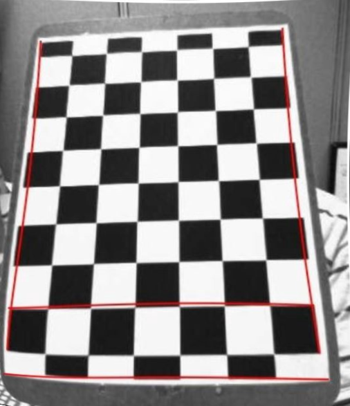

# 3D-Reconstruction
An implementation of 3D reconstruction methods given in openCV.

## Image Calibration

Getting rid of tangential and radial distortions for a certain camera output.

**before:**

**after:**

## Get a 3D axes associated wih the predominant object in the camera's perspective

## Depth Estimation by calculating disparity

### Result

